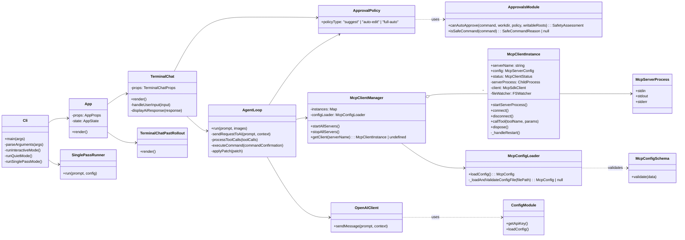
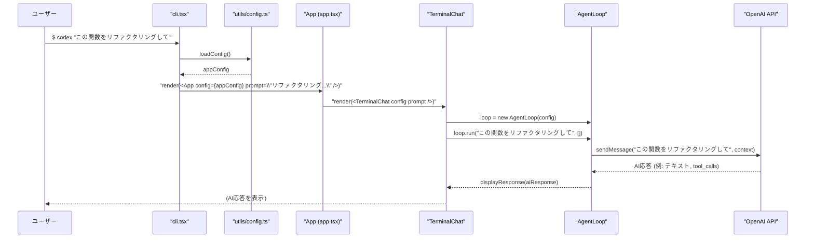
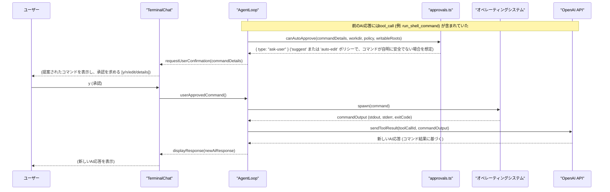
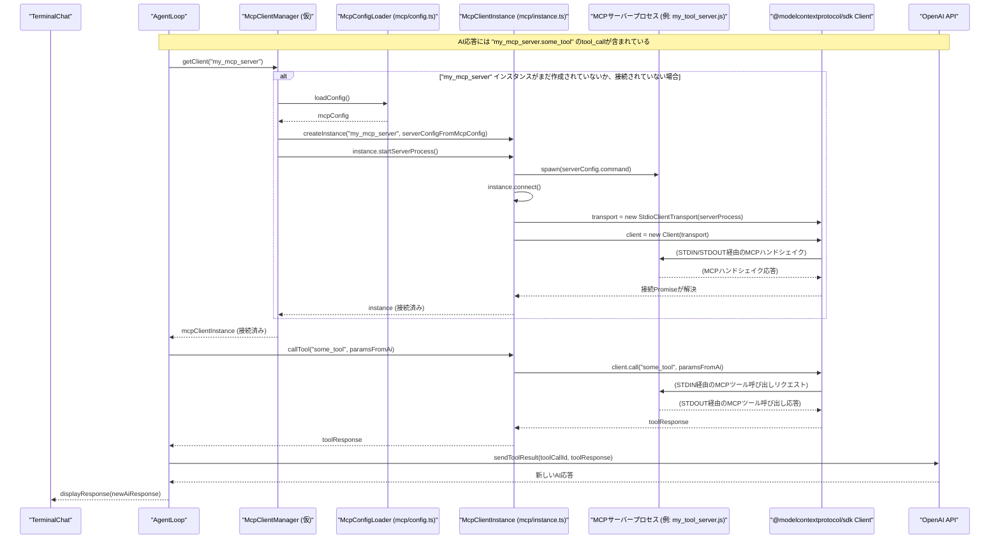

# Codex CLI アーキテクチャ概要

このドキュメントでは、`codex-cli` アプリケーションアーキテクチャの概要、主要コンポーネント、それらの相互作用、および主要な操作フローについて説明します。

## 主要コンポーネント

`codex-cli` は、インタラクティブなターミナルインターフェースに Ink を使用して構築された Node.js/TypeScript アプリケーションです。主要なコンポーネントは次のとおりです。

- **`cli.tsx` (エントリーポイント):**
  - `meow` を使用してコマンドライン引数を解析します。
  - インタラクティブモード (`App` コンポーネント経由) または非インタラクティブモード (`runQuietMode`, `runSinglePass`) でアプリケーションを起動します。
  - `utils/config.ts` 経由で初期設定を読み込みます。
- **`app.tsx` (コアUI & 状態管理):**
  - Ink ベースのTUIのメインReactコンポーネントです。
  - ライブ対話用の `TerminalChat` または以前のセッションを表示するための `TerminalChatPastRollout` をレンダリングします。
  - トップレベルのアプリケーション状態と `TerminalChat` に渡されるpropsを管理します。
  - Gitリポジトリ外で実行する際にユーザーに警告するロジックが含まれています。
- **`components/chat/terminal-chat.tsx` (インタラクティブチャットUI):**
  - ユーザーのチャット体験を担当するコアコンポーネントです。
  - 会話履歴 (ユーザープロンプト、AI応答、ツール呼び出し) の表示を管理します。
  - `AgentLoop` と統合して、ユーザー入力をAIに送信し、AI応答を処理します。
  - AIが提案したアクションを承認または拒否するためのユーザー入力を処理します。
- **`utils/agent/agent-loop.ts` (エージェントロジック):**
  - AIモデル (例: OpenAI) との会話ライフサイクルを管理します。
  - プロンプトを構築し、AIにリクエストを送信し、応答 (テキスト、ツール呼び出し) を処理します。
  - AIリクエストに基づいてツール実行 (例: シェルコマンド、ファイルパッチ) を調整します。
  - アクションが自動承認可能か、ユーザーの確認が必要かを判断するために `approvals.ts` と連携します。
  - MCP対応ツールと対話するために `McpClientManager` (または直接 `McpClientInstance`) と連携します。
- **`approvals.ts` (承認 & 安全性ロジック):**
  - AIが提案したコマンドとファイルパッチの安全性を評価する `canAutoApprove` 関数を提供します。
  - さまざまな承認ポリシー (`suggest`, `auto-edit`, `full-auto`) を実装します。
  - シェルコマンドを解析し、ファイル変更が許可された書き込み可能パス内にあるかどうかを確認するロジックが含まれています。
- **`mcp/config.ts` (`McpConfigLoader`):**
  - MCP (Model Context Protocol) サーバー設定をロード、マージ、検証します。
  - グローバル (`~/.codex/mcp_config.json`) およびプロジェクト (`./.codex/mcp_config.json`) の場所からJSON設定ファイルを読み込みます。
  - スキーマ検証に `zod` を使用し、設定の結合に `deepmerge` を使用します。
- **`mcp/instance.ts` (`McpClientInstance`):**
  - 単一のMCPサーバープロセスのライフサイクルを管理します。
  - ロードされた設定に基づいてサーバープロセスを起動します。
  - `@modelcontextprotocol/sdk` (`Client` および `StdioClientTransport`) を使用してサーバーへの接続を確立します。
  - サーバープロセスのイベント (stderr、exit、エラー) を監視します。
  - スクリプトファイルが変更された場合にサーバーを自動的に再起動するための `chokidar` ベースのファイル監視が含まれています。
  - MCPサーバーによって公開されるツールに接続、切断、および (最終的には) 呼び出すためのメソッドを提供します。
- **`utils/config.ts` (CLI設定):**
  - APIキー、デフォルトAIモデル、プロバイダーなどのグローバルCLI設定のロードとアクセスを処理します。
  - 環境変数や、場合によってはCLI固有の設定ファイルから読み込む可能性があります。

## クラス図

_注意: `McpClientManager` は、複数の `McpClientInstance` を管理するために `activeContext.md` に基づいて仮定されたクラスであり、まだ完全には実装されていない可能性があります。_

## シーケンス図

### 1. CLI起動と初期プロンプト (インタラクティブモード)

この図は、ユーザーがプロンプト付きで `codex` を実行してから、最初のAI応答が表示されるまでのフローを示しています。

### 2. AIによるコマンド提案とユーザー承認 (インタラクティブモード)

この図は、AIがシェルコマンドを提案し、ユーザーに承認を求めるプロセスを示しています。

### 3. MCPサーバーとの対話 (MCP経由のツール呼び出し)

この図は、`codex-cli` がModel Context Protocolを介して外部ツールと対話する方法を示しています。

この概要は、`codex-cli` のアーキテクチャを理解するための良い出発点となるはずです。詳細については、それぞれのソースファイルを確認してください。
