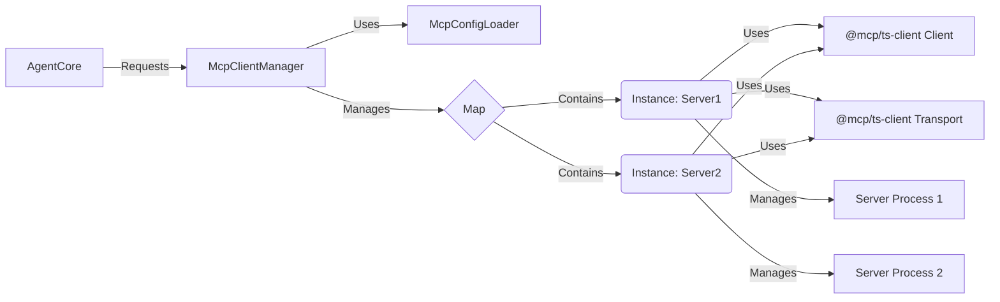
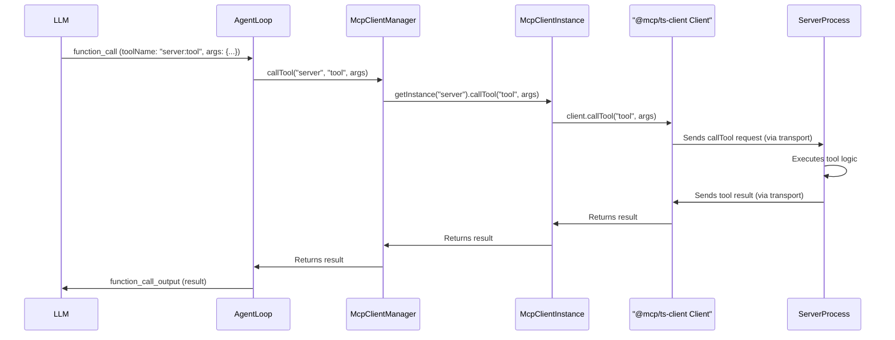

# MCP クライアント統合 設計書

## 1. 目的

本文書は、OpenAI Codex CLI (`codex-cli`) に Model Context Protocol (MCP) クライアント機能を統合するための設計を概説します。

この統合の主な目的は、Codex エージェントの現在の能力（主にファイルの読み書きとサンドボックス化されたシェルコマンド実行）を拡張することです。MCP サーバーに接続することにより、Codex エージェントは以下のような広範な外部ツールやデータソースを活用できるようになります:

- **Web 検索:** インターネットから最新情報にアクセスする（例: Brave Search MCP サーバー経由）。
- **データベースアクセス:** データベースにクエリを実行し、対話する（例: PostgreSQL, SQLite MCP サーバー）。
- **API 連携:** 専用の MCP サーバーを通じて様々なサードパーティ API と対話する（例: GitHub, Slack, Jira）。
- **ブラウザ自動化:** Web スクレイピングを実行したり、Web ページと対話したりする（例: Puppeteer MCP サーバー経由）。
- **特殊ツール:** 成長を続ける MCP エコシステムによって提供されるその他のツールを利用する。

この機能強化により、Codex エージェントは標準化され安全な方法でローカルファイルシステムを超えた情報にアクセスし、より広範な開発タスクに取り組むことが可能となり、大幅に強力かつ多用途になることを目指します。

## 2. MCPサーバーの設定方法

Codex CLI が接続する MCP サーバーは、設定ファイルによって管理します。これにより、ユーザーは利用したいツールやデータソースに応じて柔軟にサーバー構成を定義できます。設定方法は Claude Desktop のアプローチを参考にします。

### 2.1. 設定ファイルの場所と優先順位

以下の2つの場所にある設定ファイルをサポートします。

1.  **グローバル設定ファイル:**
    - 場所: ユーザーのホームディレクトリ配下 (`~/.codex/mcp_config.json`)
    - 用途: ユーザー全体で共通して利用したい MCP サーバーを定義します。
2.  **プロジェクト設定ファイル:**
    - 場所: プロジェクトのルートディレクトリ配下 (`<プロジェクトルート>/.codex/mcp_config.json`)
    - 用途: 特定のプロジェクトでのみ利用したい MCP サーバーや、グローバル設定を上書きしたい場合に定義します。
    - `.gitignore` に追加することを推奨します（特に API キーなどの機密情報を `env` に含める場合）。

**読み込みとマージ:**

- Codex CLI 起動時に、まずグローバル設定ファイルを読み込みます。
- 次に、現在のワークスペース（プロジェクトルート）にプロジェクト設定ファイルが存在すれば、それを読み込みます。
- 両方のファイルに同じサーバー名（キー）が存在する場合、**プロジェクト設定ファイルの内容がグローバル設定を上書き**します。これにより、プロジェクト固有の設定を優先できます。
- ファイルが存在しない場合は、そのレベルの設定はスキップされます。両方存在しない場合は、MCP サーバーは利用できません。

### 2.2. 設定ファイルの形式と内容

設定ファイルは **JSON形式** とします。ファイル名は `mcp_config.json` とします。

ファイルの内容は以下の構造を持ちます。

```json
{
  "mcpServers": {
    "<サーバー名1>": {
      "command": ["<実行コマンド>", "<初期引数1>", "..."], // 必須: サーバープロセスを起動するコマンドと引数
      "env": {
        // 任意: サーバープロセスに渡す環境変数
        "<環境変数名1>": "<値1>",
        "<環境変数名2>": "<値2>"
      },
      "enabled": true, // 任意: このサーバー設定を有効にするか (デフォルト: true)
      "capabilities": {
        // 任意: クライアントが要求するCapability (デフォルト: すべて false)
        "roots": false,
        "sampling": false,
        "logging": false
        // 他のCapabilityも将来的に追加可能
      }
      // 将来的な拡張: transport (stdio/sse), url (sse用) など
    },
    "<サーバー名2>": {
      // ... 同様の構造
    }
    // ... 他のサーバー定義
  }
}
```

**フィールド詳細:**

- **`mcpServers` (必須):** 設定のルートオブジェクト。キーはMCPサーバー定義を含むオブジェクトです。
- **`<サーバー名>` (必須):**
  - サーバーを一意に識別するための文字列（例: `"filesystem"`, `"github-prod"`, `"my-local-tool"`）。
  - ユーザーが設定ファイル内で定義します。
  - この名前は、将来的にログ出力や特定のサーバーを操作するコマンドなどで使用される可能性があります。
- **`command` (必須):**
  - サーバープロセスを起動するためのコマンドと引数を文字列の配列で指定します。
  - 例: `["npx", "-y", "@modelcontextprotocol/server-memory"]`, `["python", "path/to/my_server.py", "--port", "8080"]`
  - 実行パスは Codex CLI の実行環境から解決される必要があります。
- **`env` (任意):**
  - キーと値が文字列のオブジェクト。サーバープロセスに環境変数を渡します。
  - API キーや設定パスなど、サーバー固有の構成情報を渡すのに使用します。
- **`enabled` (任意):**
  - `true` または `false`。サーバー定義を一時的に無効化したい場合に使用します。
  - デフォルトは `true` です。
- **`capabilities` (任意):**
  - クライアントがこのサーバーに対して有効化を要求する MCP の Capability を指定するオブジェクト。
  - `roots`: ファイルシステムのルート管理機能。
  - `sampling`: サーバーから LLM への推論リクエスト機能。
  - `logging`: サーバーからのログメッセージ受信機能。
  - デフォルトではすべて `false` とし、必要な機能のみ明示的に有効化することを推奨します。クライアント実装側は、ここで `true` に設定された Capability のみをサーバーとのネゴシエーションで要求します。

### 2.3. CLI 引数

初期実装では、**設定ファイルを主たる設定方法**とし、複雑化を避けるため、サーバー設定に関する特別な CLI 引数は設けない方針とします。将来的に、特定のサーバーを一時的に無効化する (`--disable-mcp <サーバー名>`) などの引数を追加することは検討可能です。

### 2.4. 設定例

**`~/.codex/mcp_config.json` (グローバル設定例):**

```json
{
  "mcpServers": {
    "memory": {
      "command": ["npx", "-y", "@modelcontextprotocol/server-memory"]
    },
    "github": {
      "command": ["npx", "-y", "@modelcontextprotocol/server-github"],
      "env": {
        "GITHUB_PERSONAL_ACCESS_TOKEN": "ghp_YourGlobalGitHubToken..." // グローバルなトークン
      },
      "enabled": false // デフォルトでは無効
    }
  }
}
```

**`<プロジェクトルート>/.codex/mcp_config.json` (プロジェクト設定例):**

```json
{
  "mcpServers": {
    "filesystem": {
      "command": [
        "npx",
        "-y",
        "@modelcontextprotocol/server-filesystem",
        "./project-files"
      ], // プロジェクト内の特定ディレクトリを許可
      "capabilities": {
        "roots": true // ファイルシステムアクセスには roots が必要
      }
    },
    "github": {
      // グローバルの github 設定を上書き
      "command": ["npx", "-y", "@modelcontextprotocol/server-github"],
      "env": {
        "GITHUB_PERSONAL_ACCESS_TOKEN": "ghp_YourProjectSpecificToken..." // プロジェクト固有トークン
      },
      "enabled": true // このプロジェクトでは有効にする
    },
    "my-custom-tool": {
      "command": ["python", "./scripts/my_mcp_tool.py"],
      "env": {
        "PROJECT_API_KEY": "abc123xyz"
      }
    }
  }
}
```

**このプロジェクトでの実行結果:**

- `memory` サーバー (グローバルから)
- `filesystem` サーバー (プロジェクトから)
- `github` サーバー (プロジェクト設定で上書きされ、有効化)
- `my-custom-tool` サーバー (プロジェクトから)

が利用可能になります。

## 3. クライアントの実装詳細

MCP クライアント機能は `codex-cli` パッケージ内の TypeScript で実装します。主な責務は、設定に基づいた MCP サーバープロセスの管理、サーバーとの MCP プロトコル通信、そしてエージェントコアへのツール/リソース提供インターフェースです。

### 3.1. クラス構造

以下の主要なクラスを導入することを提案します。

- **`McpConfigLoader` (設定ローダー)**

  - **責務:**
    - グローバル (`~/.codex/mcp_config.json`) およびプロジェクト (`<プロジェクトルート>/.codex/mcp_config.json`) 設定ファイルの読み込み。
    - 設定内容のバリデーション (Zod スキーマを使用)。
    - 設定のマージ（プロジェクト設定がグローバル設定を上書き）。
    - 最終的な有効なサーバー設定リスト (`Record<string, McpServerConfig>`) を提供。
  - **配置:** `codex-cli/src/mcp/config.ts` (または同様の場所)

- **`McpClientManager` (クライアントマネージャー)**

  - **責務:**
    - `McpConfigLoader` を使用して設定を読み込む。
    - 有効な各サーバー設定に対して `McpClientInstance` を作成・管理する (内部で `Map<string, McpClientInstance>` として保持)。
    - Codex CLI のライフサイクルに合わせて、すべての `McpClientInstance` を初期化・破棄する。
    - エージェントコアからの要求に応じて、利用可能なすべての MCP ツールやリソースの一覧を提供する (各 `McpClientInstance` から集約)。
    - エージェントコアからのツール呼び出し (`callTool`) やリソース読み取り (`readResource`) リクエストを受け取り、適切な `McpClientInstance` に委譲する。
    - MCP サーバー全体のステータス管理やイベント通知（UI への通知など、将来的な拡張）。
  - **配置:** `codex-cli/src/mcp/manager.ts`
  - **備考:** Codex CLI セッションごとにシングルトン、または単一インスタンスとして生成・利用される想定。

- **`McpClientInstance` (クライアントインスタンス)**
  - **責務:**
    - 単一の MCP サーバー設定を受け取り、対応するサーバーへの接続を管理する。
    - サーバープロセスを起動・監視・終了する (STDIO トランスポートの場合、Node.js の `child_process` を使用)。
    - `@modelcontextprotocol/ts-client` SDK の `Client` およびトランスポート (`StdioClientTransport` / `SSEClientTransport` - 初期は STDIO のみ) インスタンスを作成・管理する。
    - サーバーとの接続 (`initialize`)、切断 (`close`) を行う。
    - サーバープロセスの標準入出力と `StdioClientTransport` を接続する。
    - サーバーからのイベント (エラー、クローズ、ログなど) をハンドルする。
    - `McpClientManager` からの要求に応じて、ツールリスト (`listTools`)、リソースリスト (`listResources`)、リソーステンプレートリスト (`listResourceTemplates`) をサーバーから取得する。
    - ツール呼び出し (`callTool`) やリソース読み取り (`readResource`) を実行し、結果を返す。
  - **配置:** `codex-cli/src/mcp/instance.ts`

**クラス間の関係:**



このクラス構造で、設定の読み込みから個々のサーバー接続管理、エージェントへのインターフェース提供までを整理できると考えられます。

### 3.2. AgentLoop との連携

`codex-cli` の中核的なエージェントロジックは `AgentLoop` クラス (`codex-cli/src/utils/agent/agent-loop.ts`) が担っています。MCP クライアント機能は、この `AgentLoop` と連携して動作する必要があります。

**連携のポイント:**

1.  **初期化:** `AgentLoop` のインスタンス化時、または `run` メソッドの開始時に、`McpClientManager` をインスタンス化し、設定に基づいて MCP サーバーへの接続を確立します。
2.  **ツールリストの提供:** `AgentLoop` は `run` メソッドで LLM に対話を開始する前に、`McpClientManager` から現在利用可能なすべての MCP ツールのリスト (`FunctionTool[]`) を取得します。このリストは、既存の `shellTool` と結合され、LLM へのリクエスト (`responsesCreateViaChatCompletions`) の `tools` パラメータとして渡されます。これにより、LLM は MCP ツールを認識し、呼び出すことが可能になります。
3.  **ツール呼び出しの処理:** `AgentLoop` 内の `handleFunctionCall` メソッドは、LLM からのツール呼び出しを処理します。
    - 受け取った `ResponseFunctionToolCall` の `name` を確認します。
    - 名前が `shell` であれば、既存の `handleExecCommand` を呼び出します。
    - 名前が MCP ツール（例: `github:get_issue`, `web_search:search` など、サーバー名とツール名を組み合わせた形式が考えられる）であれば、`McpClientManager` の `callTool(serverName, toolName, args)` のようなメソッドを呼び出して実行を委譲します。引数 (`args`) は `parseToolCallArguments` を利用してパースします。
4.  **結果の返却:** `McpClientManager` から返されたツールの実行結果（成功時の出力またはエラー情報）を、`AgentLoop` は `function_call_output` 形式の `ResponseInputItem` に整形し、次の LLM へのリクエストに含めます。
5.  **エラーハンドリング:** `McpClientManager` や `McpClientInstance` で発生したエラー（サーバー接続失敗、ツール実行タイムアウト、プロトコルエラーなど）は `AgentLoop` に適切に伝播され、必要に応じてユーザーに通知されたり、LLM へのエラーメッセージとして返されたりする必要があります。
6.  **クリーンアップ:** `AgentLoop` が終了する際 (`terminate` メソッドなど) に、`McpClientManager` のクリーンアップメソッドを呼び出し、すべての MCP サーバープロセスを確実に終了させ、接続を閉じます。

**ツール呼び出し時のシーケンス図:**



この連携により、`AgentLoop` は MCP ツールを既存の `shell` ツールと同様の枠組みで扱えるようになります。
